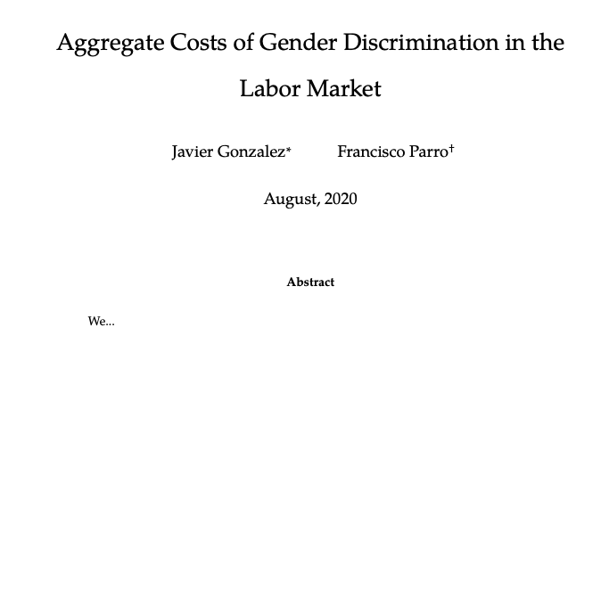
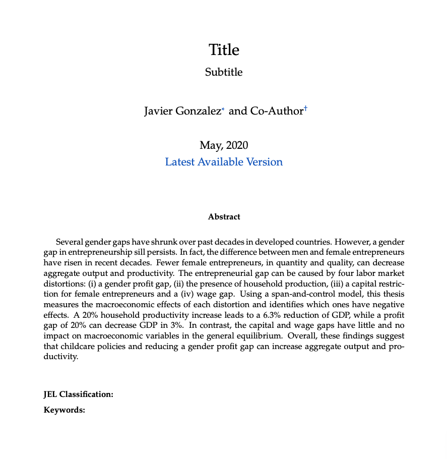
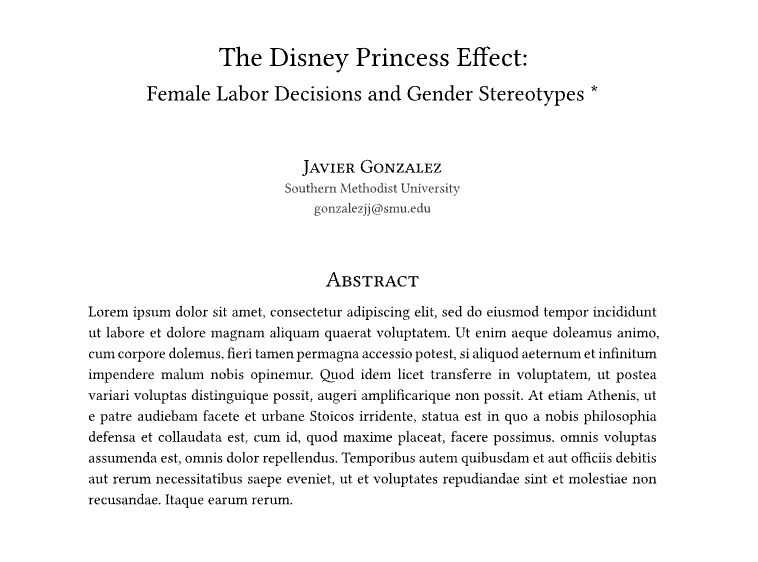
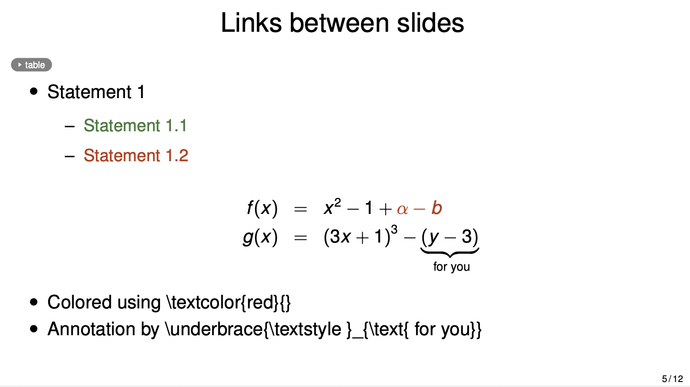
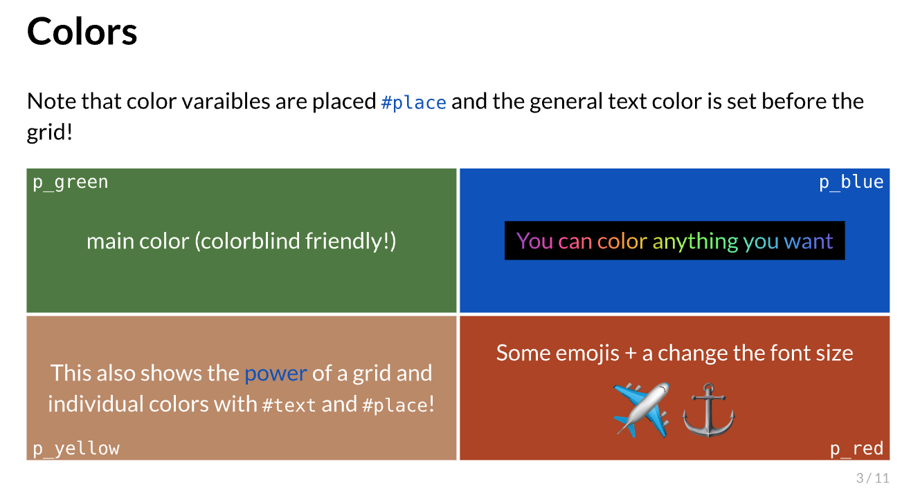
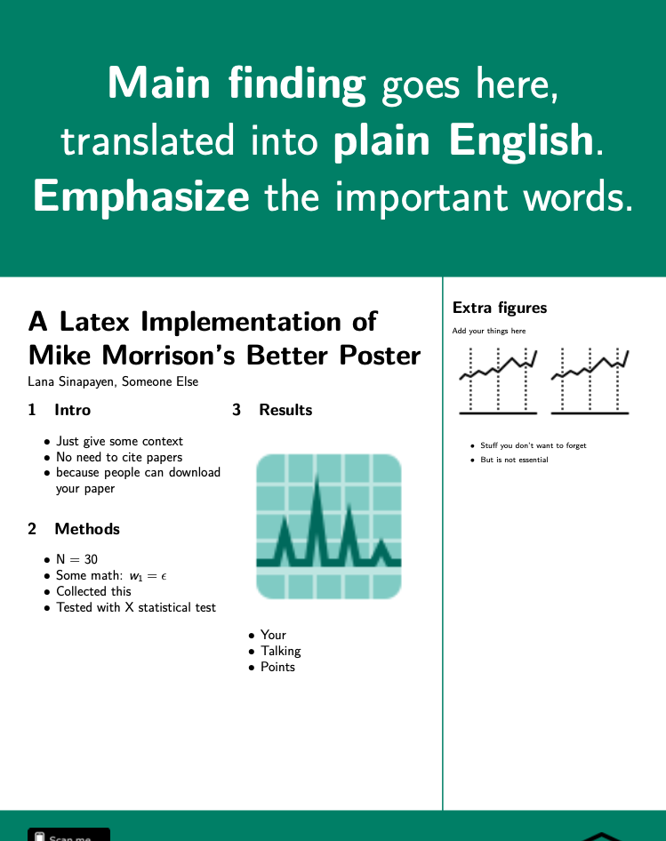
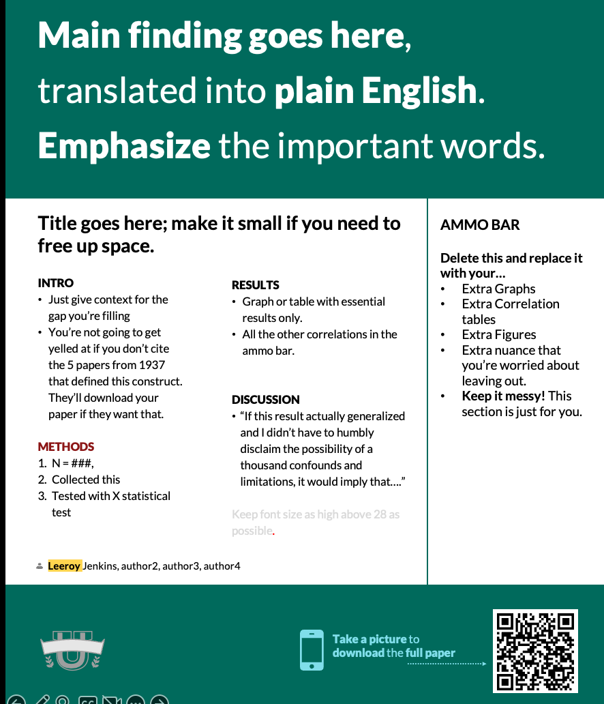
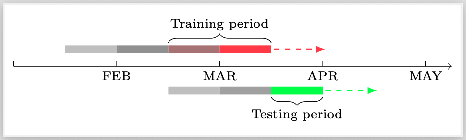

# Economic Research Templates Repository

Welcome to my collection of templates for economic research! This repository gathers all the resources, templates, and boilerplate files I use for writing papers, presentations, posters, and more. The goal is to streamline the research workflow and provide ready-to-use starting points for a variety of academic outputs.

## Repository Structure

```
research_templates/
│
├── Papers/
│   ├── LaTeX/         # LaTeX templates for academic papers
│   ├── LyX/           # LyX templates for papers
│   └── Typst/         # Typst templates for papers
│
├── Presentations/
│   ├── LyX/           # LyX templates for presentations
│   ├── PPT/           # PowerPoint poster templates
│   ├── TikZ/          # TikZ code for timelines and figures
│   └── Typst/         # Typst templates for presentations
│
├── Posters/
│   ├── Latex/         # LaTeX poster templates (landscape/portrait)
│   └── PPT/           # PowerPoint poster templates
│
├── Printouts/         # LyX printout templates for handouts/notes
│
├── Project/           # Example project structure for research projects
│
├── Referee Reports/   # Templates for referee reports and responses
│
├── 0_media/           # Images and media for documentation
│
├── SMU_Letterhead_Template.docx # Example letterhead
│
└── README.MD          # This file
```

## Section Descriptions

### Papers
- **LaTeX**: Templates for academic papers using LaTeX, including custom bibliography and formatting.
- **LyX**: LyX files for drafting and submitting papers, with ready-to-use layouts.
- **Typst**: Typst-based templates for modern typesetting of papers.

### Presentations
- **LyX**: Presentation templates in LyX for academic talks.
- **PPT**: PowerPoint poster templates (landscape and portrait).
- **TikZ**: Example TikZ code for timelines and custom figures.
- **Typst**: Typst templates for presentations, including custom themes and sample images.

### Posters

Taken from [https://betterposters.blogspot.com/](https://betterposters.blogspot.com/) by Zen Faulkes

- **Latex**: LaTeX poster templates, including the BetterPoster format (landscape and portrait).
- **PPT**: PowerPoint poster templates for conferences.

### Printouts
- LyX templates for printing handouts, homework notes, and teaching materials.

### Project
- Example folder structure for organizing research projects, including code, data, analysis scripts, and write-ups.

### Referee Reports
- Templates for writing referee reports and responses, with LaTeX and LyX examples, plus extra files for tables and custom commands.

### 0_media
- Central location for images and media used in documentation and templates.

## Supported Languages & Tools
- **LaTeX**: For papers, posters, and figures.
- **LyX**: For papers, presentations, and printouts.
- **Typst**: For papers and presentations.
- **PowerPoint (PPT)**: For posters and presentations.
- **TikZ**: For custom figures and timelines.

## Resource Gallery
Below are example images of the templates and resources included in this repository. (Add your own screenshots or sample outputs to the `0_media/` folder and reference them here.)

| Resource Type         | Example Image                                  |
|----------------------|------------------------------------------------|
| LaTeX Paper          |  |
| LyX Paper            |      |
| Typst Paper          |  |
| LyX Presentation     |        |
| Typst Presentation   |    |
| LaTeX Poster         |        |
| PPT Poster           |            |
| TikZ Timeline        |      |


---

Feel free to use, adapt, and contribute to these templates to improve your own research workflow.
