# Economic Research Templates Repository

Welcome to my collection of templates for economic research! This repository gathers all the resources, templates, and boilerplate files I use for writing papers, presentations, posters, and more. The goal is to streamline the research workflow and provide ready-to-use starting points for a variety of academic outputs.

Lately I have been mainly using Typst for both papers and presentations. It's main advantage over LaTeX it's real-time compilation time that allows me to iterate tables, figures, and slide decks. In addition, Typst error messages are super clear and in IDE like VS Code a simple click will lead you to the line with the error (in LaTeX you need to be an arquelogical expert to understand why your code dis not compile).

## Repository Structure

```
research_templates/
│
├── 0_media/           # Images and media for documentation
│
├── Codes/
│   ├── julia/         # Julia base templates, environments, and utility modules
│   └── python/        # Python base templates, environment setup, and utilities
│
├── Official_letter/   # Official letter templates (Typst)
│
├── Papers/
│   ├── LaTeX/         # LaTeX templates for academic papers
│   ├── LyX/           # LyX templates for papers
│   └── Typst/         # Typst templates for papers
│
├── Presentations/
│   ├── LyX/           # LyX templates for presentations
│   ├── Posters/       # Poster templates (LaTeX and PPT)
│   ├── TikZ/          # TikZ code for timelines and figures
│   └── Typst/         # Typst templates for presentations
│
├── Printouts/         # Printout templates (Exams, Homeworks, Solutions)
│
├── Project/           # Example project structure for research projects
│
├── Referee Reply/     # Templates for referee responses
│
├── Referee Report/    # Templates for referee reports
│
└── README.MD          # This file
```

## Section Descriptions

### Papers
- **LaTeX**: Templates for academic papers using LaTeX, including custom bibliography and formatting.
- **LyX**: LyX files for drafting and submitting papers, with ready-to-use layouts.
- **Typst**: Typst-based templates for modern typesetting of papers.

### Presentations
- **LyX**: Presentation templates in LyX for academic talks.
- **Posters**: Poster templates grouped under LaTeX and PowerPoint formats.
- **TikZ**: Example TikZ code for timelines and custom figures.
- **Typst**: Typst templates for presentations, including custom themes and sample images.

### Codes
- Language-specific starter resources for reproducible coding workflows.
- **julia/**: Base script template, environment notes, and helper modules in utils/ (file ops, plotting settings, shared utilities).
- **python/**: Base script template, package/environment setup examples (venv, uv, mamba), and utility helpers in utils/.

### Official_letter
- Typst templates for formal institutional letters.
- Includes ready-to-edit files for commonly used letter formats.

### Posters (under Presentations)

Taken from [https://betterposters.blogspot.com/](https://betterposters.blogspot.com/) by Zen Faulkes

- **Latex**: LaTeX poster templates, including the BetterPoster format (landscape and portrait).
- **PPT**: PowerPoint poster templates for conferences.

### Printouts
- LyX and Typst templates for exams, homework notes, solutions, and teaching handouts.

### Project
- Example folder structure for organizing research projects, including code, data, analysis scripts, and write-ups.

### Referee Reply
- Templates for writing structured replies to referee comments.
- Includes both LaTeX and Typst variants for response documents.

### Referee Report
- Templates focused on writing referee reports.
- Organized for concise evaluation notes and recommendation-focused writing.

### 0_media
- Central location for images and media used in documentation and templates.

## Supported Languages & Tools
- **LaTeX**: For papers, posters, and figures.
- **LyX**: For papers, presentations, and printouts.
- **Typst**: For papers and presentations.
- **PowerPoint (PPT)**: For posters and presentations.
- **TikZ**: For custom figures and timelines.

## Resource Gallery
Below are example images of the templates and resources included in this repository. 


| Resource Type         | Example Image |
|----------------------|---------------|
| LaTeX Paper          | 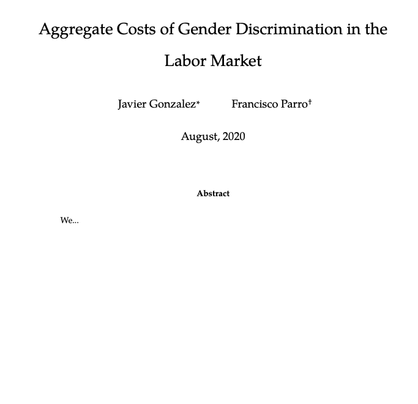  |
| LyX Paper            | 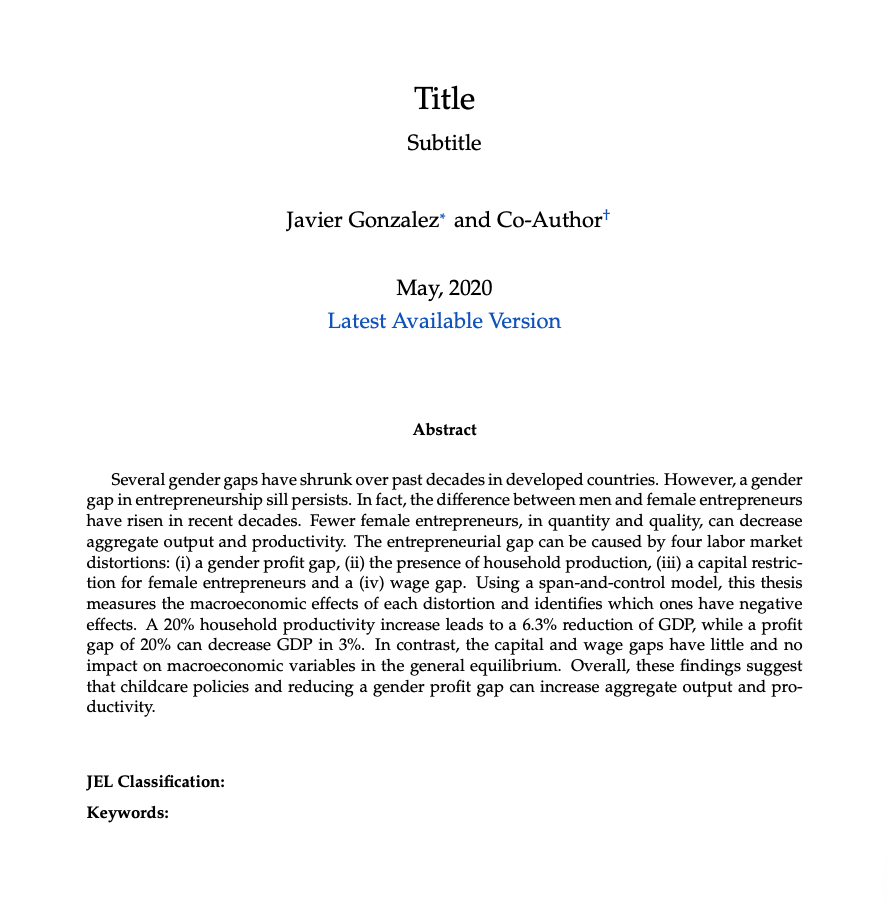 |
| Typst Paper          | 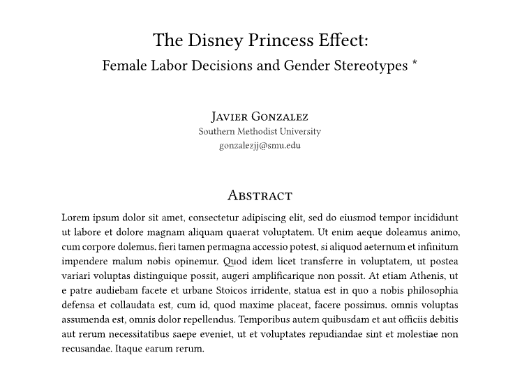 |
| LyX Presentation     | 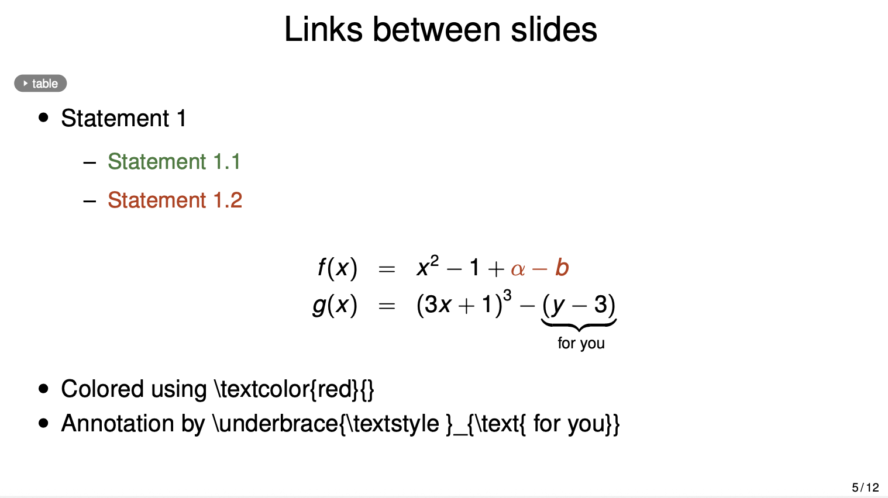       |
| Typst Presentation   | 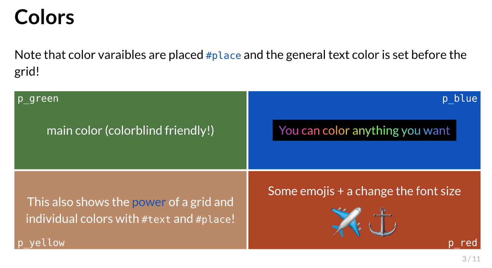   |
| LaTeX Poster         | 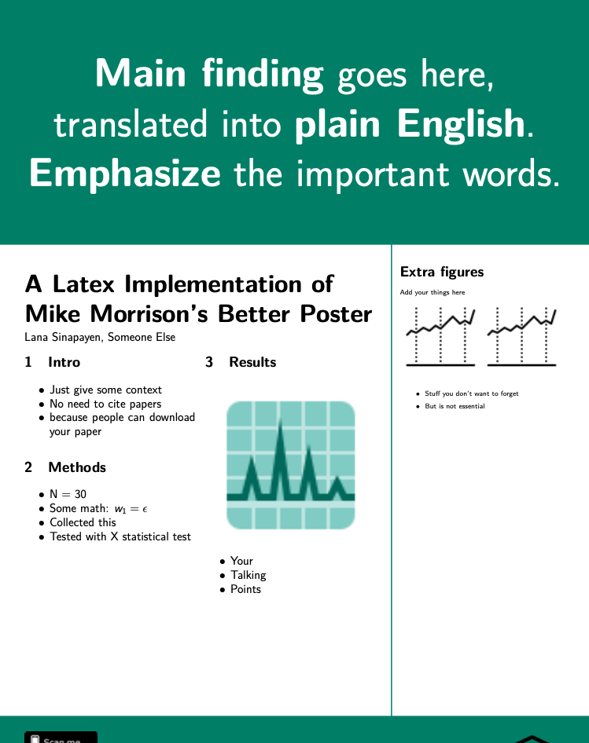       |
| PPT Poster           | 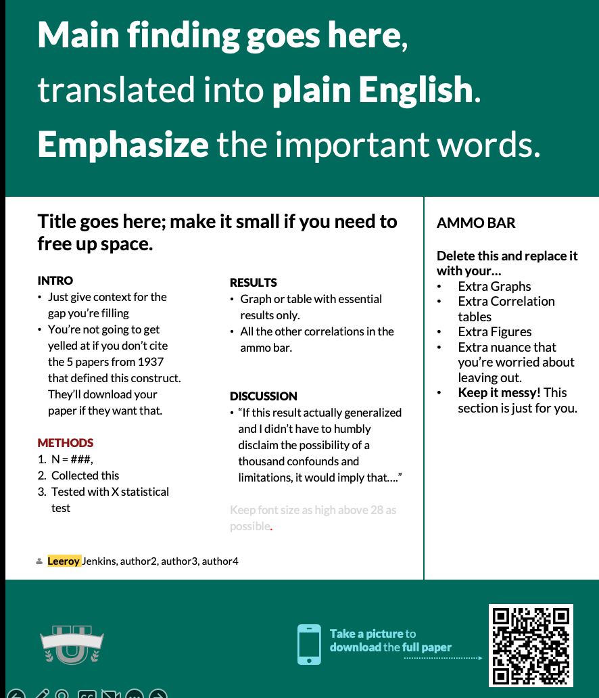           |
| TikZ Timeline        | 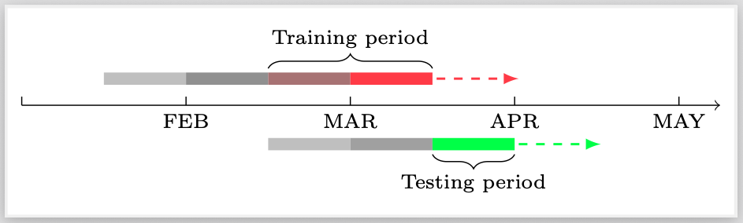     |
| Official Letter      | 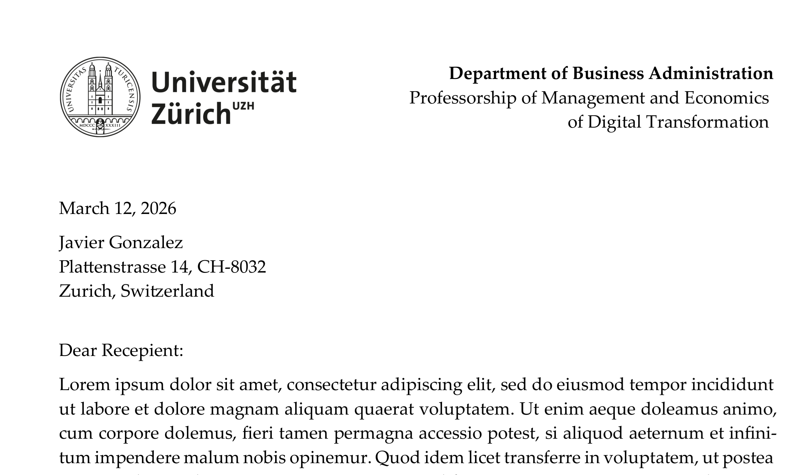 |
| Printouts            | 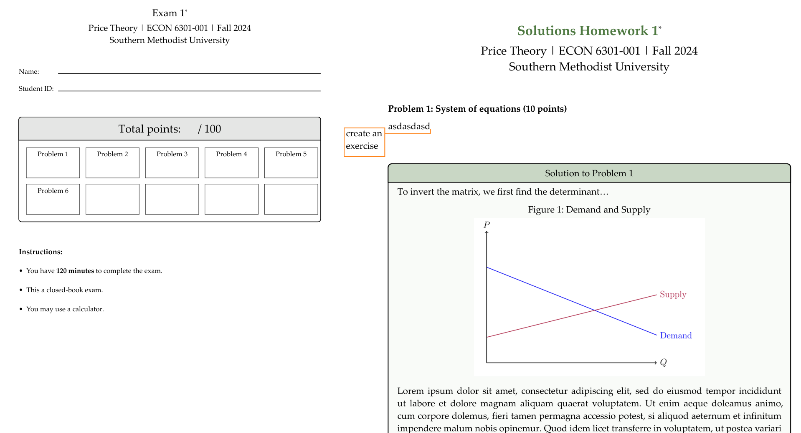 |
| Referee Reply        | 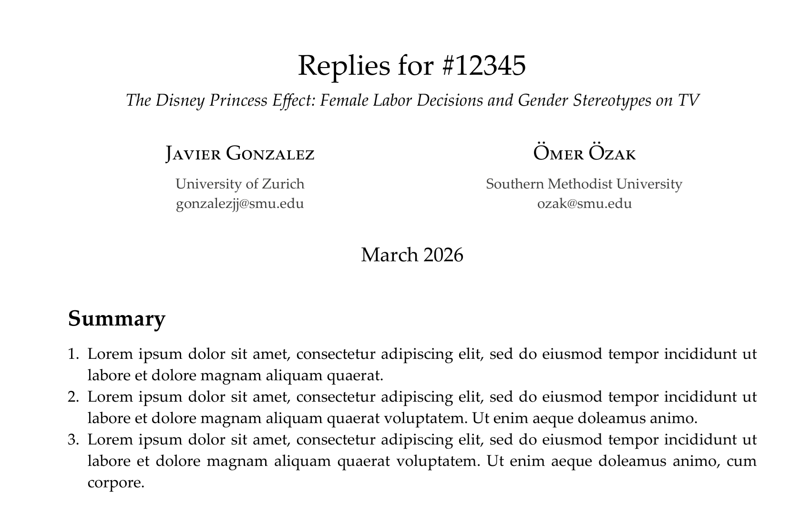 |
| Referee Report       | 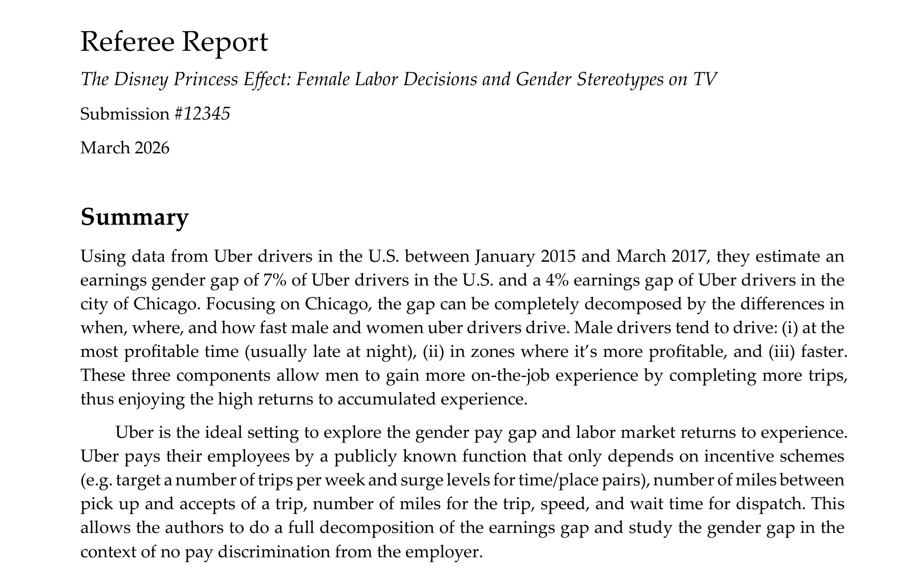 |

---

Feel free to use, adapt, and contribute to these templates to improve your own research workflow.
